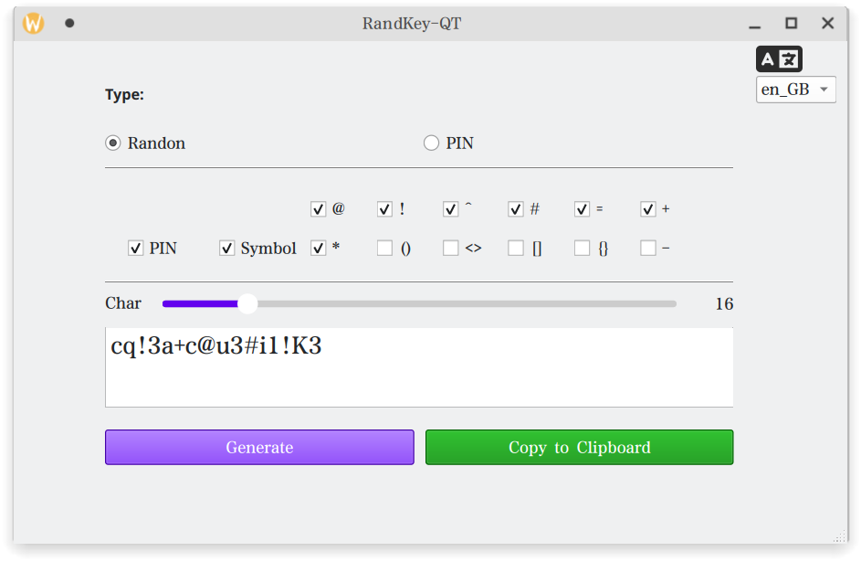
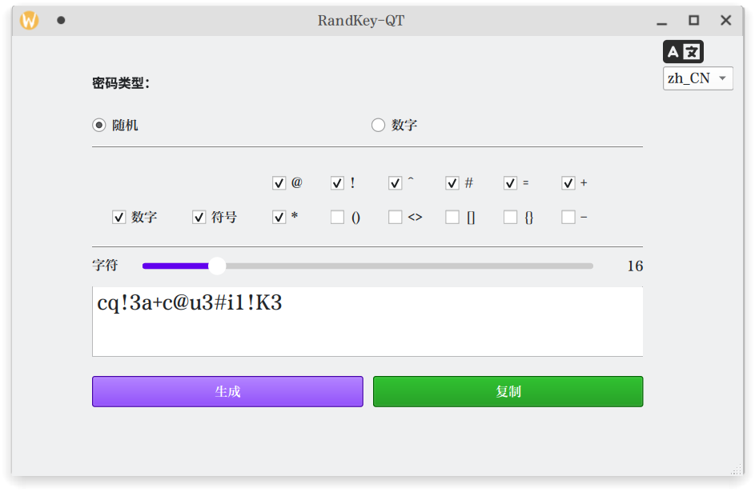

RandKey-QT
---

解决需要生成随机字符的燃眉之急

Solve the urgent need to generate random characters && numbers temporatily




用法 Usage
---

确保用的是Qt 6.8。 make sure Qt version is 6.8.

- [下载二进制 Download binary](), 直接运行 run directly.


- 或者克隆这个文件夹，然后在***Qt craetor***打开。 or clone this repository, open in ***Qt craetor***.


国际化 International
---

1. > lupdate . RandKey_QT_en_GB.ts

2. > linguist RandKey_QT_en_GB.ts

或者使用以下脚本 or use the below Shell script:
```
TS_DIR="./RandKey-QT" # .ts file
QM_DIR="$TS_DIR/translations" # output .qm dir

for tsfile in "$TS_DIR"/*.ts; do
    if [ -f "$tsfile" ]; then
        echo "Updating $tsfile "
        lupdate . -ts "$tsfile" -no-obsolete
    fi
done
this
for tsfile in "$TS_DIR"/*.ts; do
    filename=$(basename "$tsfile" .ts)   
    qmfile="$QM_DIR/$filename.qm"      
    echo "Generating $qmfile "
    lrelease "$tsfile" -qm "$qmfile"
done
```